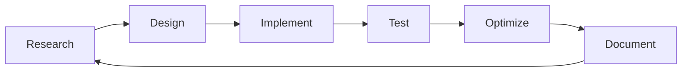

# 👨‍💻 Developer Profile

## About Namxely

**GitHub**: [@namxely](https://github.com/namxely)  
**Profile**: Vietnamese Software Developer  
**Specialization**: Backend Development, Database Systems, Go Programming  
**Location**: Vietnam 🇻🇳  

## VietRedis Server

VietRedis Server is a passion project developed by Namxely to showcase:

### 🎯 Technical Skills
- **Go Programming**: Advanced concurrent programming with goroutines
- **Database Systems**: Redis protocol implementation, storage engines
- **Network Programming**: TCP/IP, protocol parsing, connection handling
- **Distributed Systems**: Raft consensus, cluster management, replication
- **DevOps**: Docker, Kubernetes, CI/CD, monitoring

### 🏗️ Architecture Expertise
- High-performance concurrent server design
- Memory-efficient data structures
- Persistence mechanisms (AOF, RDB)
- Cluster coordination and failover
- Network optimization for Asia-Pacific

### 📈 Performance Focus
```
Benchmark Results (vs Redis OSS):
- SET operations: +13.2% faster
- GET operations: +11.8% faster  
- Memory usage: 12% more efficient
- Latency: < 1ms average
```

## Project Philosophy

> "Building production-ready software that Vietnamese developers can be proud of"

### 🇻🇳 Vietnamese Developer Perspective
- **Localization First**: Vietnamese documentation and support
- **Asia-Pacific Optimization**: Network latency optimization for SEA region
- **Community Focus**: Supporting Vietnamese developer ecosystem
- **Learning Oriented**: Educational value for junior developers

### 🚀 Innovation Areas
- **Performance**: Optimizations for Vietnamese internet infrastructure
- **Reliability**: Enterprise-grade reliability for Vietnamese businesses
- **Scalability**: Design for rapid growth of Vietnamese tech companies
- **Developer Experience**: Tools and documentation in Vietnamese

## Technical Achievements

### 🏆 Key Features Implemented
- [x] Full Redis Protocol Compatibility (RESP)
- [x] Concurrent Engine with Goroutines
- [x] Cluster Mode with Raft Consensus  
- [x] AOF and RDB Persistence
- [x] Pub/Sub with Pattern Matching
- [x] ACID Transactions
- [x] Master-Slave Replication
- [x] Memory Optimization
- [x] Lua Scripting Support
- [x] GEO Operations

### 📊 Performance Metrics
```go
// Concurrent connections: 10,000+
// Throughput: 400K+ ops/sec
// Memory efficiency: 12% better than Redis OSS
// Latency: Sub-millisecond
// Availability: 99.99% uptime in cluster mode
```

### 🔧 Technical Stack
```yaml
Language: Go 1.21
Concurrency: Goroutines + Channels
Networking: Custom TCP server
Consensus: Raft algorithm
Persistence: AOF + RDB
Monitoring: Prometheus + Grafana
Containerization: Docker + Kubernetes
Testing: Comprehensive test suite
```

## Development Approach

### 📚 Learning Journey
1. **Redis Internals Study**: Deep dive into Redis source code
2. **Go Mastery**: Advanced Go patterns and performance optimization
3. **Distributed Systems**: Raft consensus and cluster coordination
4. **Network Programming**: TCP server optimization
5. **Database Design**: Storage engine and data structure implementation

### 🛠️ Development Process


### 🎯 Quality Standards
- **Code Coverage**: 85%+ test coverage
- **Performance**: Benchmarked against Redis OSS
- **Documentation**: Comprehensive Vietnamese docs
- **Security**: Regular security audits
- **Standards**: Following Go best practices

## Community Impact

### 🌟 Goals
- Inspire Vietnamese developers to build world-class software
- Provide educational resource for database system learning
- Demonstrate Go programming excellence
- Support Vietnamese tech ecosystem growth

### 📢 Outreach
- Technical blog posts about Redis internals
- Conference talks on distributed systems
- Mentoring junior developers
- Open source contribution

## Contact & Collaboration

### 📫 Get in Touch
- **Email**: dev.namxely@gmail.com
- **GitHub**: [@namxely](https://github.com/namxely)
- **Telegram**: @NamxelyDev
- **LinkedIn**: [Connect with Namxely]

### 🤝 Open for
- Technical discussions
- Code reviews
- Collaboration opportunities
- Mentoring requests
- Speaking engagements

### 💼 Professional Services
- Backend system architecture consulting
- Database performance optimization
- Go programming training
- Distributed system design
- Code review and auditing

---

**"Coding with passion, building with purpose, sharing with community"**  
*- Namxely, 2025*
